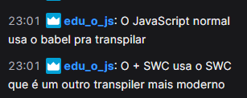

##### troca de versão no nvm
`nvm use 16.15` -> o último digito não é tão importante assim, é o patch de  correção
`nvm install 18.0` -> vai instalar com o ultimo patch de correção
`nvm install 18.0.0` -> vai instalar com o patch que eu pedir

#### diferença js ou js+swc

#### como saber onde por o css {socorro deus}
se for um css de "configuração de ambiente", ex box-sizing, fontes, tamanhos, manda no index se for um css de aparência normal, bota no app
